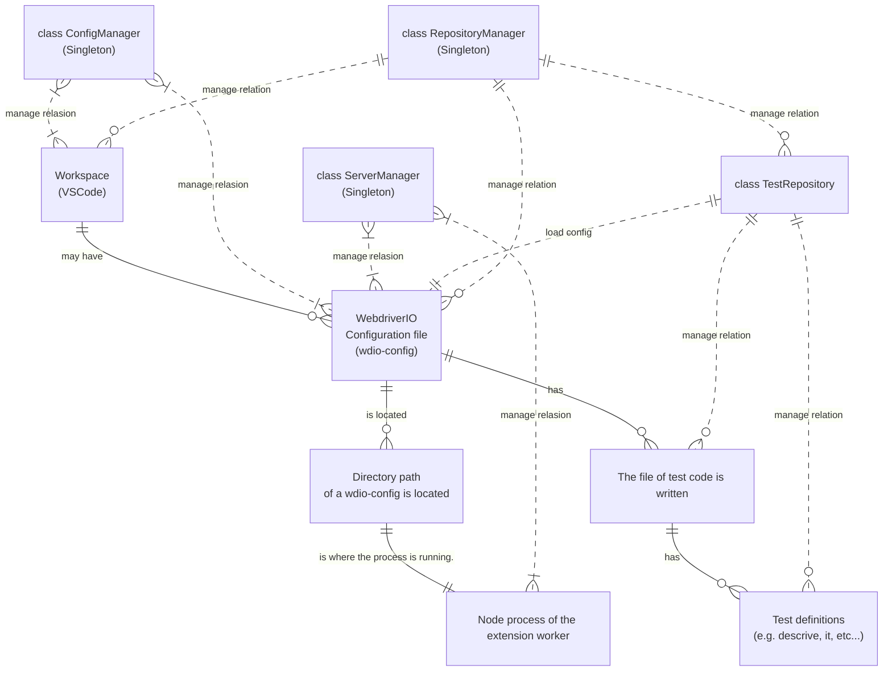

```mermaid
erDiagram
    wscode["Workspace <br> (VSCode)"]
    wdio-config["WebdriverIO<br>Configuration file<br>(wdio-config)"]
    worker-cwd["Directory path<br>of a wdio-config is located"]
    worker["Node process of the extension worker"]
    wdio-spec["The file of test code is written"]
    wdio-suite["Test definitions<br>(e.g. descrive, it, etc...)"]

    CONFIG_MANAGER["class ConfigManager<br>(Singleton)"]
    SERVER_MANAGER["class ServerManager<br>(Singleton)"]
    REPOSITORY["class TestRepository"]
    REPOSITORY_MANAGER["class RepositoryManager<br>(Singleton)"]


    wscode ||--o{ wdio-config : "may have"
    wdio-config ||--o{ worker-cwd : "is located"
    worker-cwd ||--|| worker : "is where the process is running."
    wdio-config ||--o{ wdio-spec : has
    wdio-spec ||--o{ wdio-suite : has

    CONFIG_MANAGER }|..|{ wscode : "manage relasion"
    CONFIG_MANAGER }|..|{ wdio-config : "manage relasion"

    SERVER_MANAGER }|..|{ wdio-config : "manage relasion"
    SERVER_MANAGER }|..|{ worker : "manage relasion"

    REPOSITORY ||..|| wdio-config: "load config"
    REPOSITORY ||..o{ wdio-spec: "manage relation"
    REPOSITORY ||..o{ wdio-suite: "manage relation"

    REPOSITORY_MANAGER ||..o{ REPOSITORY: "manage relation"
    REPOSITORY_MANAGER ||..o{ wdio-config: "manage relation"
    REPOSITORY_MANAGER ||..o{ wscode: "manage relation"
```
